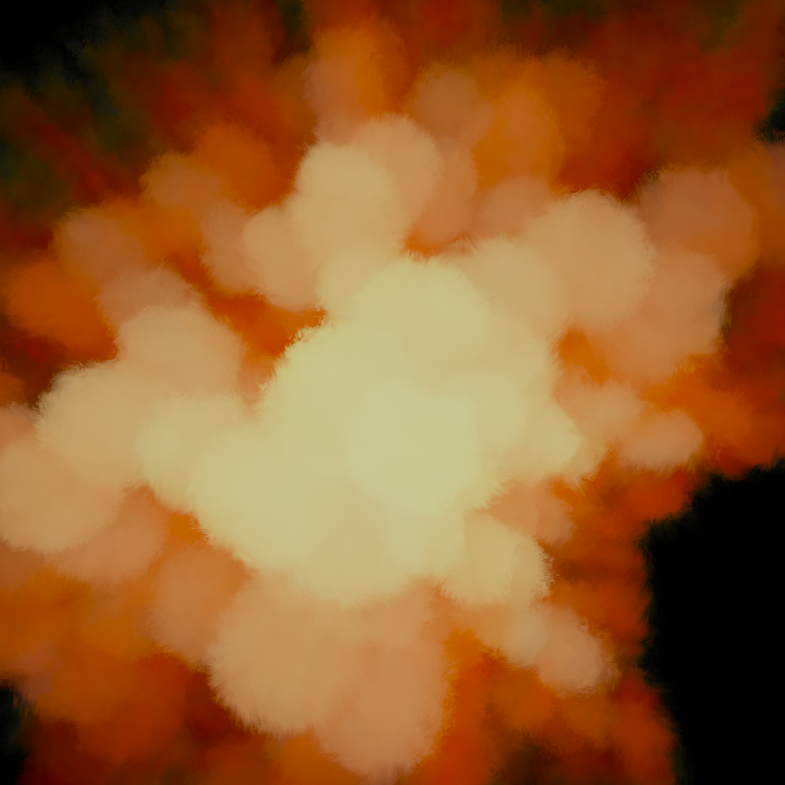
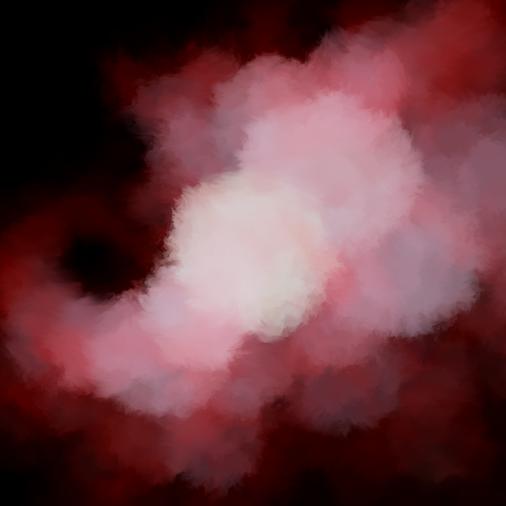
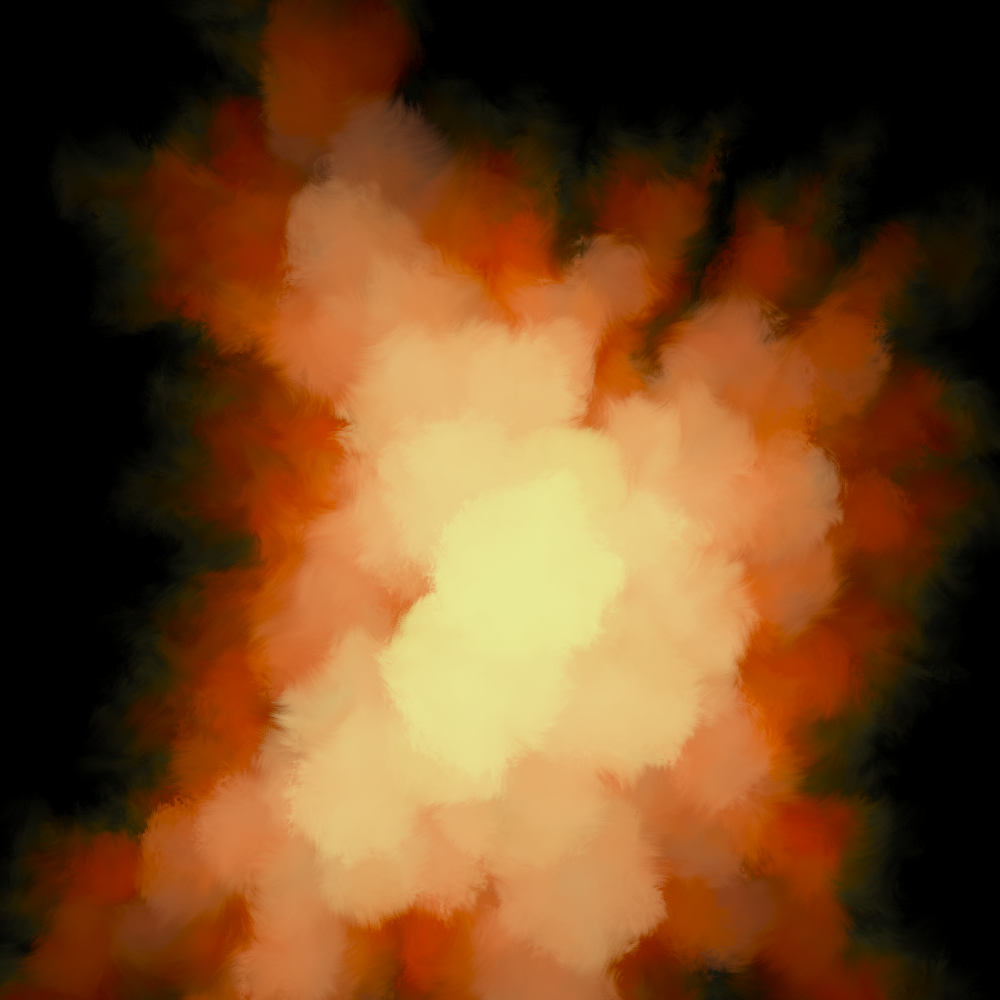
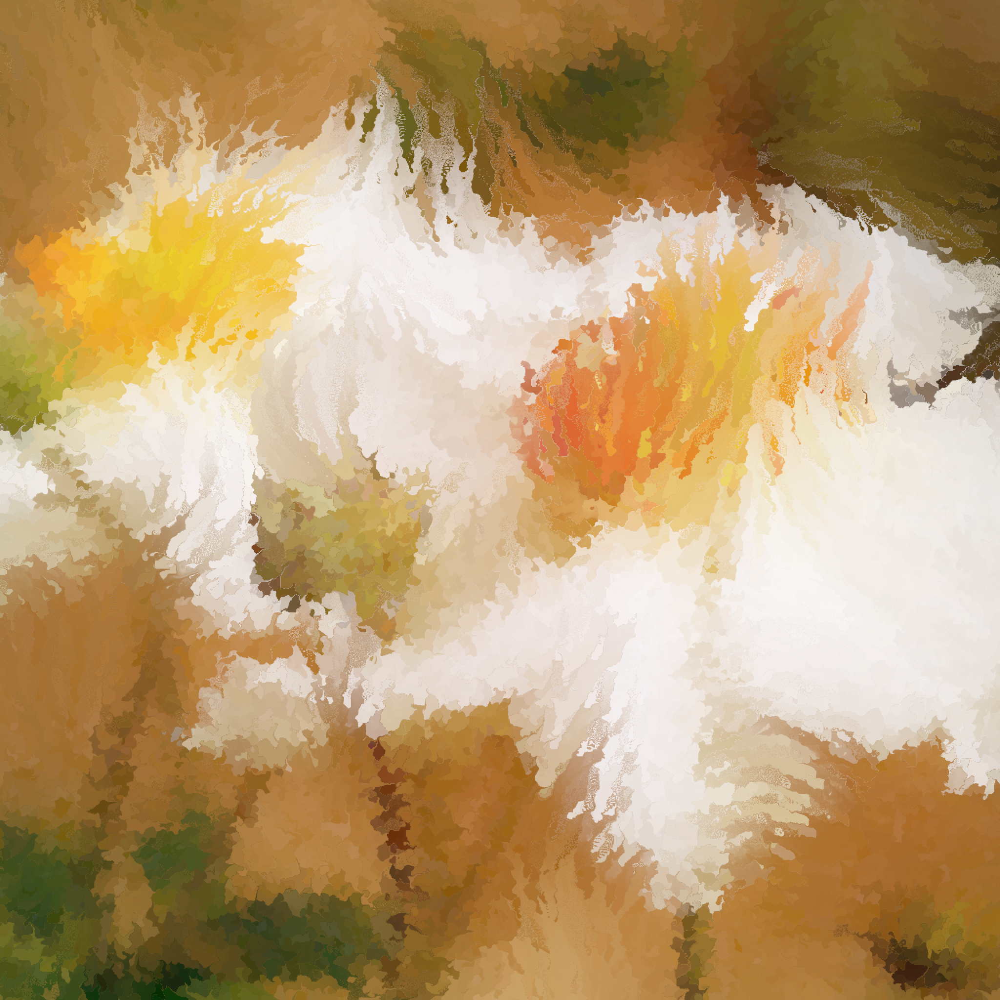

# Fractal Ink

## A Branch-and-Flow Operator for Differentiable Image Evolution

Originally developed as an exploration of procedural watercolor rendering, Fractal Ink generalizes the idea of repeated image deformation into a differentiable functional operator applicable to arbitrary images and image-generating functions.

The current implementation is written as a real-time GLSL shader.

## Gallery

## Animation

▶ **[Watch the animation](videos/fractal_ink_demo.mp4)**

## Motivation

The project was inspired by Tyler Hobbs' procedural watercolor experiments, where many distorted copies of the same polygon are alpha-composited to create organic watercolor-like structures.

Rather than operating on polygons, Fractal Ink applies the same intuition to arbitrary image-generating functions through repeated domain warping.

The primary design goals were:

applicability to arbitrary images;
differentiability;
continuous animation;
real-time rendering;
compatibility with future optimization-based methods.

## The Operator

The operator is defined as

$$
f_{\mathrm{result}}(x)=
\sum_{i=1}^{m}
\sum_{j=1}^{n}
w_{ij}
(f\circ g_i\circ h^j)(x),
$$

subject to

$$
\sum w_{ij}=1.
$$

## Visual Interpretation

Branching functions generate multiple alternative versions of the original image.

Repeated application of the flow operator evolves each branch independently.

The final image represents the weighted accumulation of many possible trajectories.

## Operator Structure

## Visual Breakdown

## Features
- differentiable construction
- domain warping framework
- real-time GLSL implementation
- smooth animation
- compatible with arbitrary image functions

## Current Implementation
The current implementation uses Fractal Brownian Motion vector fields both for branching and flow operators.

The shader renders in real time while preserving smooth continuous animation.

## Future Work
- tensor implementation
- differentiable optimization
- adaptive flow fields
- recursive branching
- interactive control
- moving blob experiments

## Paper
The complete technical description is available here.

[FractalInk.pdf](pdf/FractalInk.pdf)
## Citation
@misc{FractalInk2026,
  title={Fractal Ink: A Branch-and-Flow Operator for Differentiable Image Evolution},
  author={NAMELESS},
  year={2026}
}

## Repository Status
This repository currently contains the conceptual description of the operator and visual examples.

The source code will be released separately after the design stabilizes.