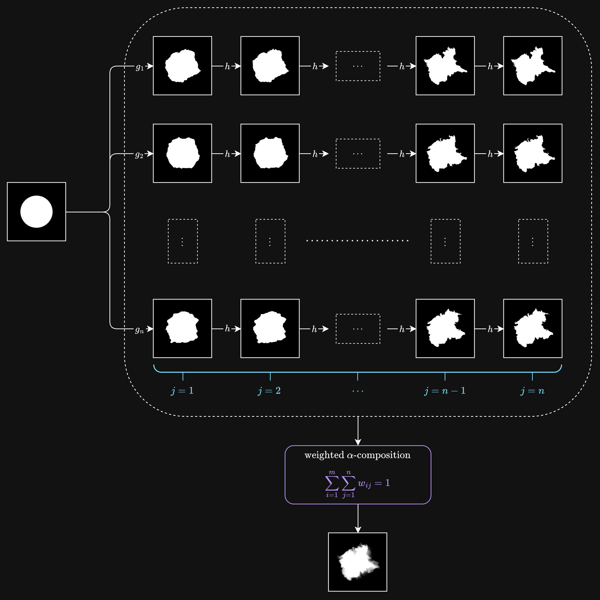
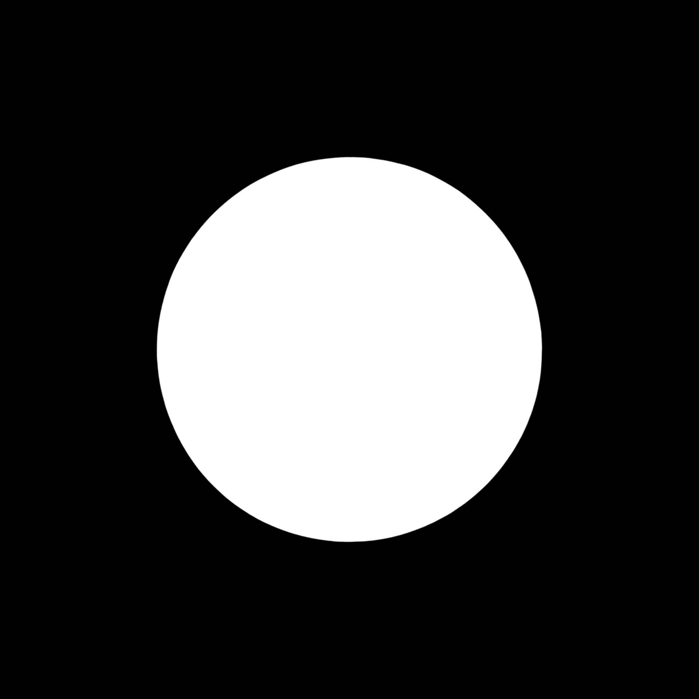
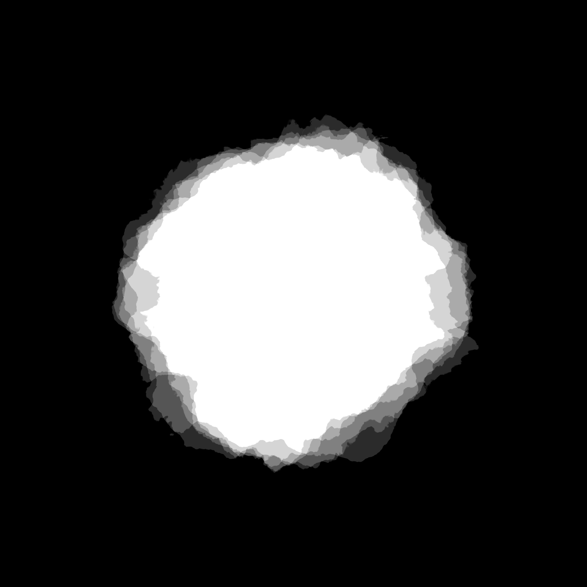
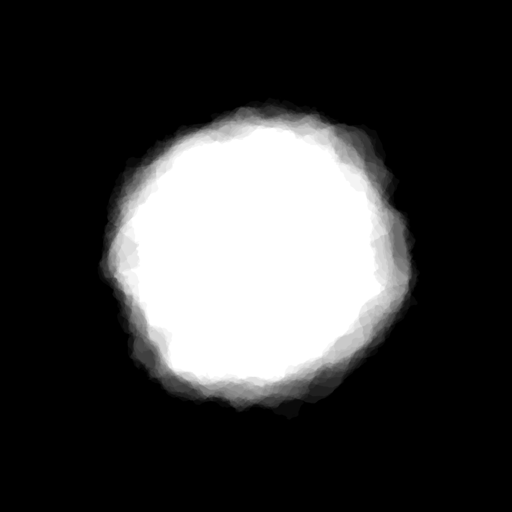
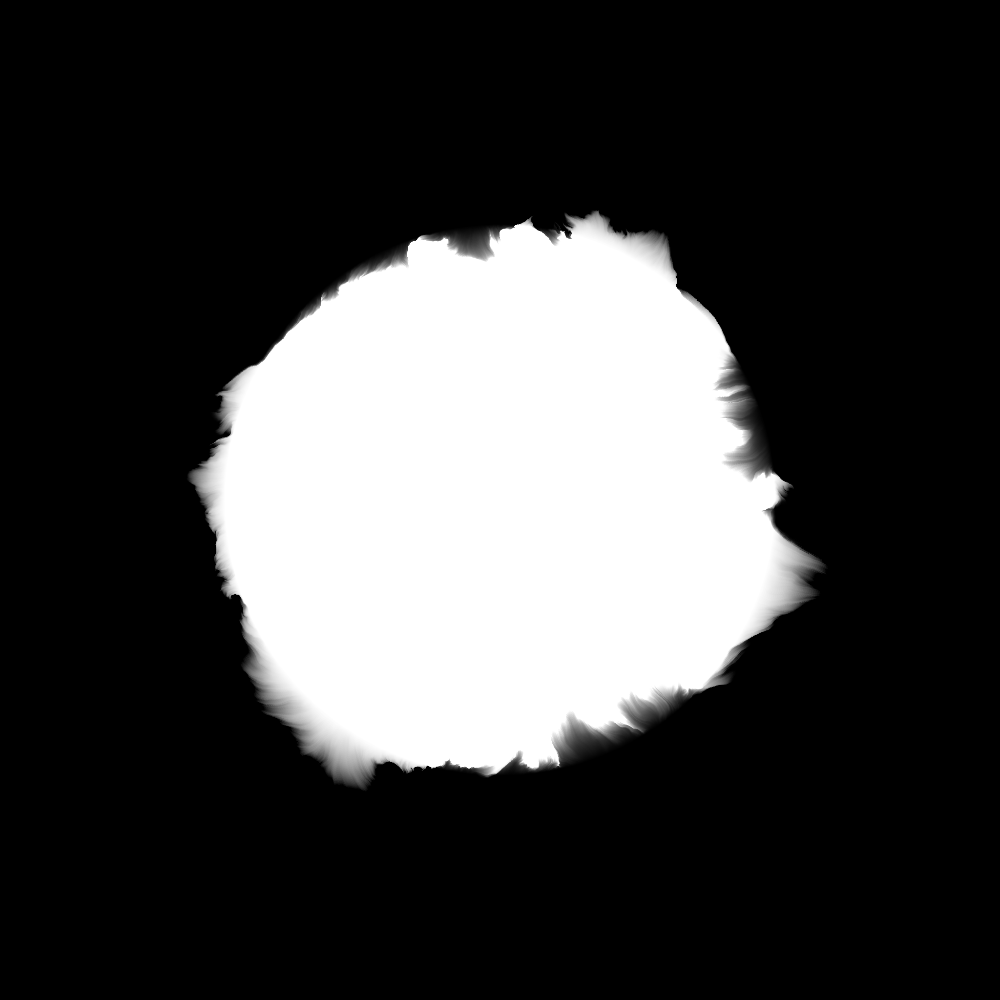
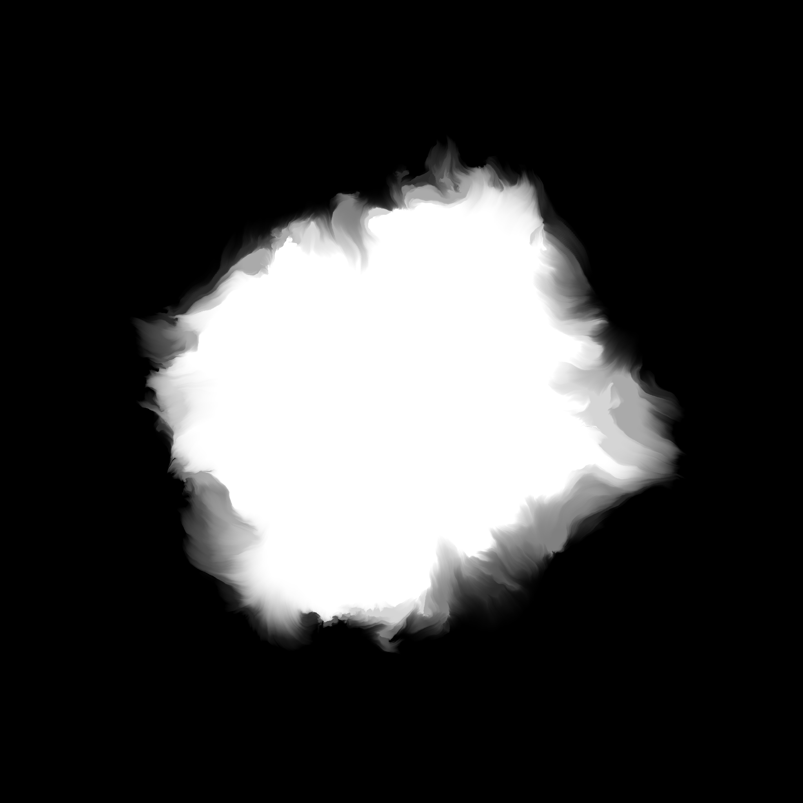
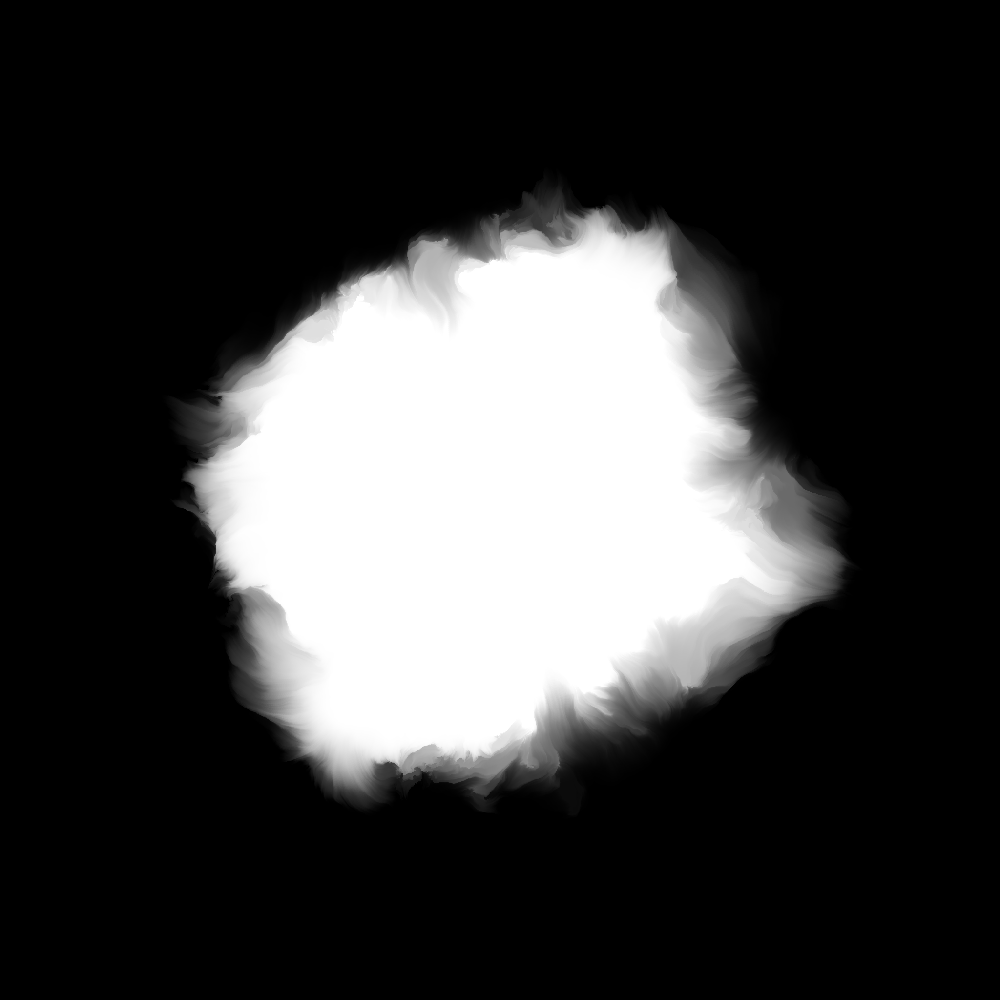
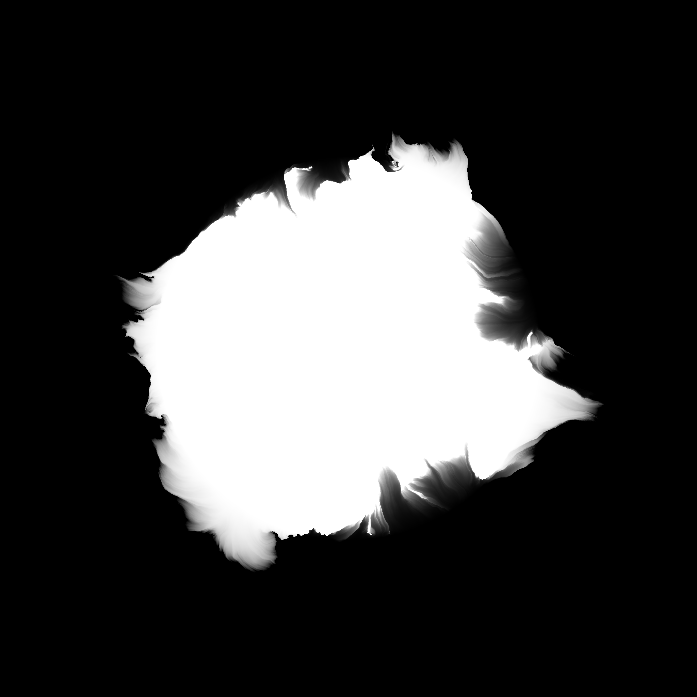
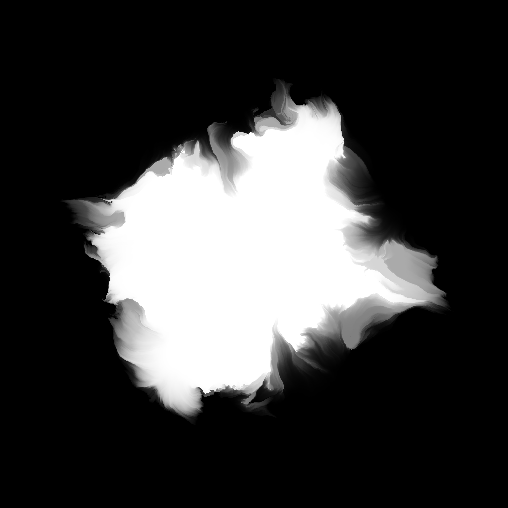

# Fractal Ink

## A Branch-and-Flow Operator for Differentiable Image Evolution

**Ilya Krepkiy** — independent research project

Originally developed as an exploration of procedural watercolor rendering, Fractal Ink generalizes the idea of repeated image deformation into a differentiable functional operator applicable to arbitrary images and image-generating functions.

> **Status:** Research prototype / visual demonstration

The current implementation is written as a real-time GLSL shader. The repository documents the current operator formulation and selected visual results; it is not intended as a production implementation or a fully reproducible reconstruction of the exact visual examples.

## Gallery

## Animation

▶ **[Watch animation — Sequence 0](videos/sequence_0.mp4)**  
▶ **[Watch animation — Sequence 1](videos/sequence_1.mp4)**

## Motivation

The project was inspired by Tyler Hobbs' procedural watercolor experiments, where many distorted copies of the same polygon are alpha-composited to create organic watercolor-like structures.

Rather than operating on polygons, Fractal Ink applies the same intuition to arbitrary image-generating functions through repeated domain warping.

Conceptually, the operator separates three roles: **branching** creates a diversity of related trajectories, **flow** evolves each trajectory through repeated deformation, and **accumulation** combines their contributions into the resulting image.

The primary design goals were:

- applicability to arbitrary images;
- construction from differentiable transformations;
- continuous animation;
- real-time rendering;
- compatibility with future optimization-based methods.

## The Operator

The operator is defined as

$$
f_{\mathrm{result}}(x)=
\sum_{i=1}^{m}
\sum_{j=1}^{n}
w_{ij}
(f\circ g_i\circ h^j)(x),
$$

subject to

$$
\sum w_{ij}=1.
$$

## Operator Structure

## Visual Interpretation

Branching functions generate multiple alternative versions of the original image, creating a diversity of related trajectories.

Repeated application of the flow operator evolves each branch independently along its own trajectory.

The final image represents the weighted accumulation of these trajectories, so the result is not simply a single warped image but a spatial accumulation of related evolutions.

## Visual decomposition

The operator can be viewed as the interaction of two components: **branching** and **flow**. The following examples vary the number of layers contributed by each component independently.

| **Flow ↓ / Branching →** |                                 **0**                                 |                                 **6**                                 |                                  **24**                                 |
| :----------------------: | :-------------------------------------------------------------------: | :-------------------------------------------------------------------: | :---------------------------------------------------------------------: |
|           **0**          |    |    |    |
|          **32**          |  |  |  |
|          **64**          |  |  |  |

Here, the numbers indicate the **number of layers** generated by the corresponding component. A value of `0` disables that component entirely.

With no flow, the individual branched layers remain visually distinguishable. Increasing the flow progressively transforms the discrete layers into a continuous brush-like accumulation. Branching nevertheless remains significant even at large flow values: different branches produce different trajectories and therefore different spatial coverage, resulting in richer regions of partial overlap and color mixing.

The bottom-right example combines **24 branching layers with 64 flow layers**, for a total of **1536 contributing layers**.

## Features
- construction from differentiable transformations
- domain warping framework
- real-time GLSL implementation
- smooth animation
- compatible with arbitrary image functions

## Current Implementation
The current implementation uses Fractal Brownian Motion vector fields both for branching and flow operators.

The shader renders in real time while preserving smooth continuous animation.

## Future Work
- tensor implementation
- differentiable optimization
- adaptive flow fields
- recursive branching
- interactive control
- moving blob experiments

## Citation
@misc{Krepkiy2026FractalInk,
  title={Fractal Ink: A Branch-and-Flow Operator for Differentiable Image Evolution},
  author={Ilya Krepkiy},
  year={2026}
}

## License

No open-source license is currently granted for this repository. All rights are reserved unless otherwise stated.
